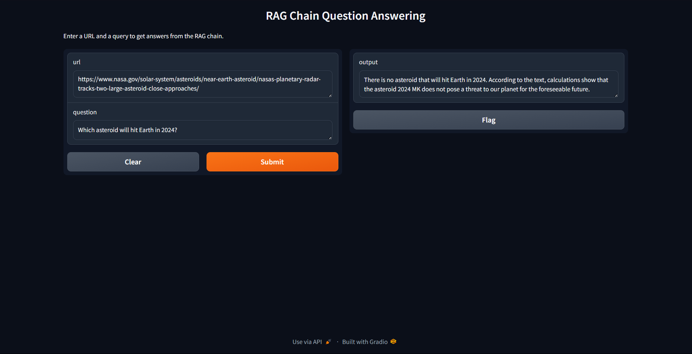

# RAG Application with LLaMA 3 and Gradio UI

This project implements a Retrieval-Augmented Generation (RAG) application using the LLaMA 3 language model from Ollama. It also includes a user-friendly interface built with Gradio.

## Features

- RAG implementation using LLaMA 3 for question answering
- Web scraping and document processing capabilities
- Vector store creation using Chroma and Ollama embeddings
- Interactive UI powered by Gradio

## Installation

1. Install the required packages:
    
    pip install ollama langchain beautifulsoup4 chromadb gradio
    ollama pull llama3
    ollama pull nomic-embed-text

2. Pull the necessary models using Ollama:
    
    ollama pull llama3
    ollama pull nomic-embed-text

## Usage

The application allows users to input a URL and a question. It then scrapes the content from the URL, processes it, and uses the RAG technique with LLaMA 3 to generate an answer based on the retrieved information.

To run the Gradio UI:

        ```python
        '''
        from Gradio_UI import launch_gradio

        launch_gradio()
        '''
        ```



## How It Works

* Web content is scraped and split into chunks
* Chunks are embedded and stored in a vector database
* User questions trigger relevant document retrieval
* Retrieved documents and the question are passed to LLaMA 3
* LLaMA 3 generates an answer based on the context and question

## Contributing

Contributions, issues, and feature requests are welcome. Feel free to check issues page if you want to contribute.

License
MIT


